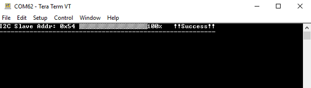

### **Using I2C SDCARD Host application to send the application binary to Target development kit**

1. Open the SDCARD host application project *bootloader_apps_sam_d20\apps\i2c_bootloader_wlcsp\host_app_sdcard\firmware\sam_e54_xpro.X* in the IDE

2. Build and program the SDCARD host application using the IDE on to the I2C host dvelopment kit

3. Build and generate the application binary to be bootloaded. 

4. Copy the application binary generated in step 3, into the SD card and rename the binary to *image.bin* as shown in below.

5. Insert the SD card in the SD card slot available on the [SAM E54 Xplained Pro Evaluation Kit](https://www.microchip.com/developmenttools/ProductDetails/atsame54-xpro) 

6. Open the Terminal application (Ex.:Tera Term) on the computer

7. Configure the serial port settings for **Host Development kit** as follows:
    - Baud : 115200
    - Data : 8 Bits
    - Parity : None
    - Stop : 1 Bit
    - Flow Control : None

7. Press the Switch **SW0** on the Host development kit to trigger programming of the application binary

8. Once the programming is complete,
    - **LED0** on the Host development kit will be turned on indicating success

    - Following message will be displayed on the terminal of **Host development kit**

        

    - The target will be reset. Upon re-start, the boot-loader will jump to the user application    